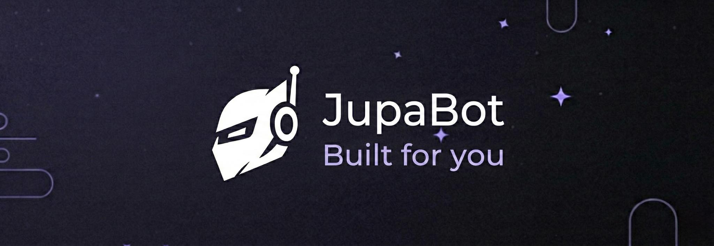

# JupaBot

[](LICENSE)
[](https://fluxer.gg/2bkFSWcs)
[](https://web.fluxer.app/oauth2/authorize?client_id=1474871739022057472&scope=bot&permissions=8)

A fully-featured example bot for the [Fluxer](https://fluxer.app) platform, built with [Fluxer.RUST](https://github.com/DeviMorris/Fluxer.RUST).

Covers moderation, welcome card generation via a custom API, reaction role assignment, and a full CAPTCHA verification flow.

---

## Commands

| Command | Description |
|---------|-------------|
| `!ping` | Bot latency check |
| `!help [command]` | List all commands or get details on a specific one |
| `!avatar [@user]` | Show your avatar or another user's |
| `!serverinfo` | Show current server info |
| `!dog` `!cat` `!fox` `!duck` | Random animal images |
| `!ban <@user/id> [duration] [days] [reason]` | Ban a member |
| `!unban <id/username>` | Unban a member |
| `!kick <@user/id> [reason]` | Kick a member |
| `!mute <@user/id> [duration] [here/everywhere/#channel] [reason]` | Mute a member |
| `!unmute <@user/id> [#channel]` | Unmute a member |
| `!clear <amount>` | Delete messages in bulk |
| `!welcome [#channel] title: [text] text: [text]` | Send a welcome message with reaction |
| `!greet` | Manually trigger a welcome card for a user |

---

## Events

| Event | What happens |
|-------|-------------|
| `GuildMemberAdd` | Automatically generates and sends a welcome card to the configured channel |
| `MessageReactionAdd` | Assigns roles on reaction - with optional CAPTCHA verification via DM |
| `MessageCreate (DM)` | Handles CAPTCHA answers sent by users in direct messages |

---

## CAPTCHA Flow

When a user reacts to a welcome message with CAPTCHA enabled, the bot:

1. Calls the JupaAPI to generate a CAPTCHA image
2. Sends it to the user via DM
3. Waits for the correct text response
4. Assigns the configured roles on success


---

## Welcome Card

Generated automatically on `GuildMemberAdd` or manually via `!greet`.


---

## Help Command


---

## Quick Start

1. Clone the repository.
2. In `src/shared.rs` replace `TOKEN` with your bot token.
3. Start a [PocketBase](https://pocketbase.io) instance at `http://127.0.0.1:8090` and import the schema from `db/pb_schema.json` via **Settings -> Import collections**.
4. Run:
```bash
cargo run
```

---

## Structure

| File | What it does |
|------|-------------|
| `src/main.rs` | Gateway event loop, CAPTCHA DM handler |
| `src/commands.rs` | All bot commands |
| `src/db.rs` | PocketBase client |
| `src/shared.rs` | Token, constants, embed helpers, CAPTCHA state |
| `src/util.rs` | Misc utilities |
| `db/pb_schema.json` | PocketBase collections schema |
---

## Community

[Fluxer.RUST Community](https://fluxer.gg/2bkFSWcs)

---

## License

MIT [LICENSE](LICENSE)